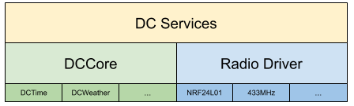

# DCCore

Data Cloud Core is the repo for all the common code of the connected devices at my desk. These basic building blocks are used in several other projects to disseminate time, environmental information and other data wirelessly.

