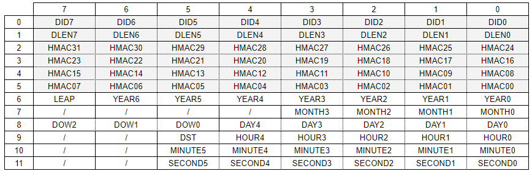

# DCCore

Data Cloud Core is the repo for all the common code of the connected devices at my desk. These basic building blocks are used in several other projects to disseminate time, environmental information and other data wirelessly.

# vSIM

vSIM (Virtual Subscriber Identification Module) is the DCCore way to handle/store the basic parameters for a device to make use of the network. It is expected to be stored in EEPROM starting at address DCCORE_EEPROM_VSIM_BASE. It contains things such as a unique device ID (or 0 for non addressable devices), and a secret key (shared among all devices) which is used for the datagram HMAC calculation and verification.

**V7..0** vSIM version ID (0-255). Current version is V.0

**KEY63..0** HMAC secret key. This is an 8-octet key shared among all devices in the network used to generate/verify the datagrams' HMAC

**UID7..0** Unique ID. A unique device ID (0-255), where needed. For devices that don't need to be addressed this should be set to 0.

## Installation

A vSIM can be installed (written) to a device EEPROM by sending it over serial port at 9600 BAUD, base64 encoded, and prefixed by `!V`. **NOTE**: the device will need to be calling regularly DCServices::loop(). For instance the vSIM with content:

`00.32.33.34.35.36.37.38.39.01`

can be sent over serial as:

`!VADIzNDU2Nzg5AQ==`

The device will reply `vSIM OK` or `vSIM ERROR`.

**NOTE**: you will need to copy/paste the vSIM string into the terminal, you won't be able to type it as, to avoid blocking other services, there is a 1s timeout from when the `!V` sequence is received.

# Datagrams

## Datagram Header

Every datagram has a header. The header format does not change with the datagram type.

**DID7..0** Datagram ID. An 8-bit ID of the datagram type. Below a list of datagram types.

|ID|Type|
|--|---|
|0x20|Time|

**DLEN7..0** Datagram Length. Length in bytes of the datagram, including the whole header and payload.

**HMAC31..0** Datagram signature. A signature calculated on the datagram payload, prefixed by all the header octets except the HMAC itself, and a secret key. The secret key is an 8-octet key shared among all devices and never transmitted across the netwrok. The HMAC (keyed-hash message authentication code) is a HMAC-SHA256 truncated to 4 octets.

## Time Datagram (0x20)

A time datagram carries information about current local date and time. While the broadcast time is taken from an accurate source (NTP or Radio signals such as DCF-77), this broadcast -due the the varied nature of the radio schemes, hardware, and software in the radio stack- is not meant to provide "atomic clock" precision time, the time will however be correct with 1 second accuracy or better.

**Octets 0..5** See "Datagram Header" above.

**LEAP** If set the current year is a leap year.

**YEAR6..0** Year last two digits (00-99) of the current year.

**MONTH3..0** Current month (1-12)

**DOW2..0** Current day of the week (0=MON, 7=SUN)

**DOW4..0** Current day (1-31)

**DST** If set the Daylight Savings Time (summer time) is active.

**HOUR4..0** Current hour in 24-hour format (0-23)

**HOUR5..0** Current minute (0-59)

**HOUR5..0** Current second (0-59)

