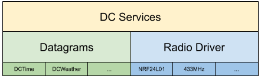
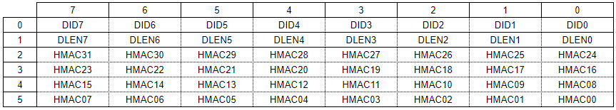

# DCCore

Data Cloud Core is the repo for all the common code of the connected devices at my desk. These basic building blocks are used in several other projects to disseminate time, environmental information and other data wirelessly.

# Datagrams

## Datagram Header

Every datagram has a header. The header format does not change with the datagram type.

## Time Datagram

A time datagram carries information about current local date and time.

Octets 0-5 See "Datagram Header" above.

Octet 6 Year

**LEAP** If set the current year is a leap year.

**YEARn** Year last two digits (00-99)

